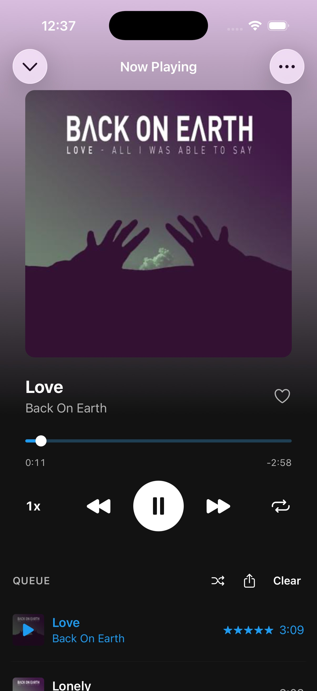
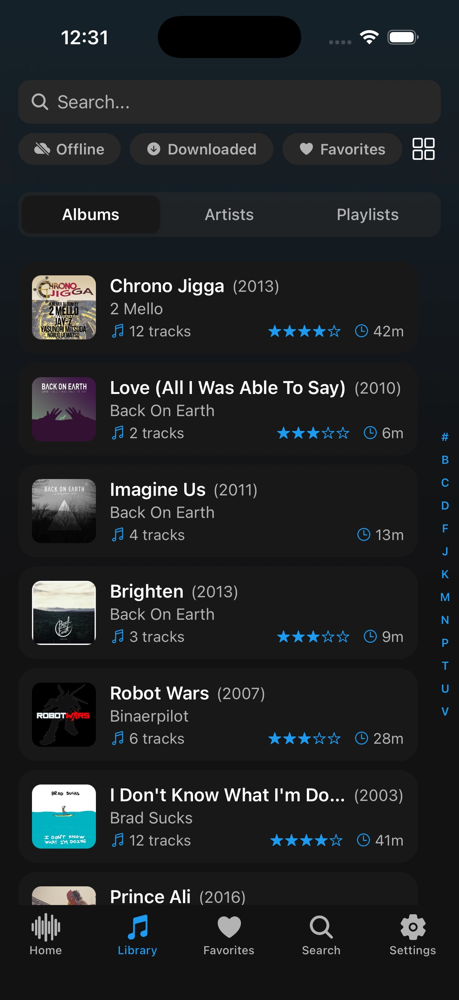
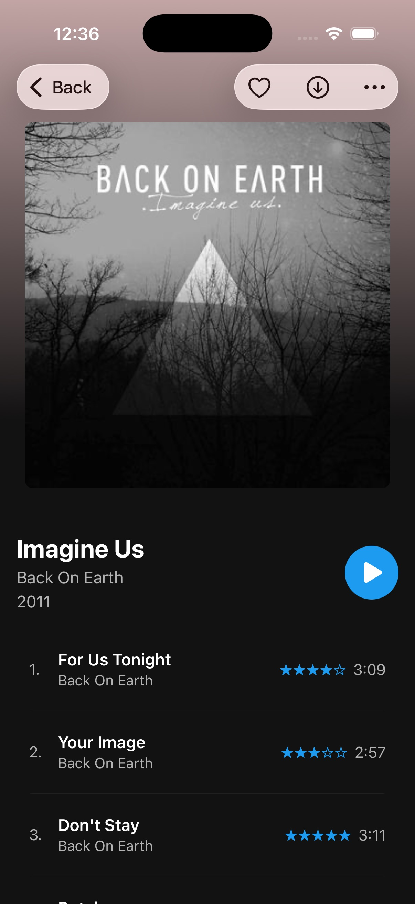

# ReSubstreamer

<p align="center">
  <strong>The modern, independent open-source hard fork of Substreamer for Android.</strong>
</p>

<p align="center">
  <a href="https://github.com/monti8403/ReSubstreamer/releases/latest">
    
  </a>
  <a href="https://github.com/monti8403/ReSubstreamer/blob/main/LICENSE">
    
  </a>
  <a href="http://www.subsonic.org/pages/api.jsp">
    
  </a>
  <a href="https://github.com/monti8403/ReSubstreamer/releases">
    
  </a>
  
</p>

---

## Overview

**ReSubstreamer** is a community-driven, open-source hard fork of the classic **Substreamer** music player. 

It keeps the familiar, distraction-free interface loved by thousands of self-hosters while eliminating long-standing pain points: upgrading the underlying framework and background audio engine, fixing queue synchronization bugs, and adding critical modern playback features for audio enthusiasts.

---

## Screenshots

<p align="center">
  
  
  
</p>

---

## Why ReSubstreamer?

- **Drop-in Replacement:** Compatible with your existing Subsonic credentials and cached configurations.
- **Privacy-First & Completely Free:** Zero analytics trackers, zero telemetry, and zero ads.
- **Built for Self-Hosters:** Tailored for servers hosting lossless audio collections where cellular bandwidth control and buffer stability matter.

---

## Key Enhancements

### 1. Dual Network Bitrate Management
Set independent audio streaming profiles based on connectivity:
- **Wi-Fi:** Stream untruncated FLAC, ALAC, or high-bitrate MP3/Opus (Max Fidelity / 320 kbps).
- **Cellular / Mobile Data:** Automatically transcode on-the-fly to 128/192 kbps Opus/MP3 to prevent buffering dips and save mobile quota.

### 2. Carousel Track Navigation & Gesture Controls
- **Album Hero Swipe:** Fluid horizontal gestures directly on the album artwork to switch tracks backwards and forwards.
- **Swipe-up Anywhere Queue:** Drag or flick up smoothly anywhere on the playback view to inspect and reorder upcoming songs.
- **Mini-Player Quick Controls:** Swipe horizontally on the persistent mini-player banner to skip or repeat tracks without expanding the screen.

### 3. Re-Architected Queue Engine
- Reliable drag-and-drop song reordering without state loss.
- Immediate queue appending with deterministic index tracking.
- Pre-buffering engine ensuring gapless-like track handoff even with variable latency.

### 4. Modernized Android & Audio Stack
- Upgraded target SDK compliant with modern Android permissions and background battery management restrictions.
- High-priority background audio playback service with Android media notification controls.
- Optimized local database indexing and caching layer for faster library rendering on large collections (>50,000 tracks).

---

## Server Compatibility

ReSubstreamer connects with any media server implementing the standard **Subsonic API**:

| Server | Compatibility | Notes |
| :--- | :---: | :--- |
| **Navidrome** | Full | Fully tested with modern token authentication & transcoding |
| **Subsonic** | Full | Subsonic API v1.13.0+ |
| **Gonic** | Full | Fast browsing and lightweight streaming |
| **Airsonic-Advanced** | Full | Complete tag metadata and artwork support |
| **LMS (Lyrion Music Server)** | Full | Via Subsonic / UPnP bridge plugins |
| **Jellyfin** | Full | Requires the Subsonic API Jellyfin plugin |

---

## Installation

Download the latest standalone `.apk` directly from the [GitHub Releases](https://github.com/monti8403/ReSubstreamer/releases/latest) page:

1. Download `ReSubstreamer-vX.X.X.apk` onto your Android device.
2. Open the file and allow **"Install from unknown sources"** when prompted by your browser/file manager.
3. Launch ReSubstreamer, enter your server URL (e.g., `https://music.yourdomain.com`), username, and password/app token.

---

## Building from Source

### Prerequisites
- Android SDK (API Level 35) & NDK
- Node.js 20+ / Java JDK 17
- Git

### Build Instructions

```bash
# Clone the repository
git clone https://github.com/monti8403/ReSubstreamer.git
cd ReSubstreamer

# Install dependencies
npm install

# Compile the standalone debug/release APK
cd android
./gradlew app:assembleDebug
# or for release:
# ./gradlew app:assembleRelease
```

The compiled APK will be available in:  
`android/app/build/outputs/apk/debug/app-debug.apk`

---

## Acknowledgements & Licensing

- ReSubstreamer is an independent hard fork inspired by and built upon the foundations laid by the original **Substreamer** project.
- Distributed under the **GNU General Public License v3.0**. See [LICENSE](LICENSE) for full legal text.
